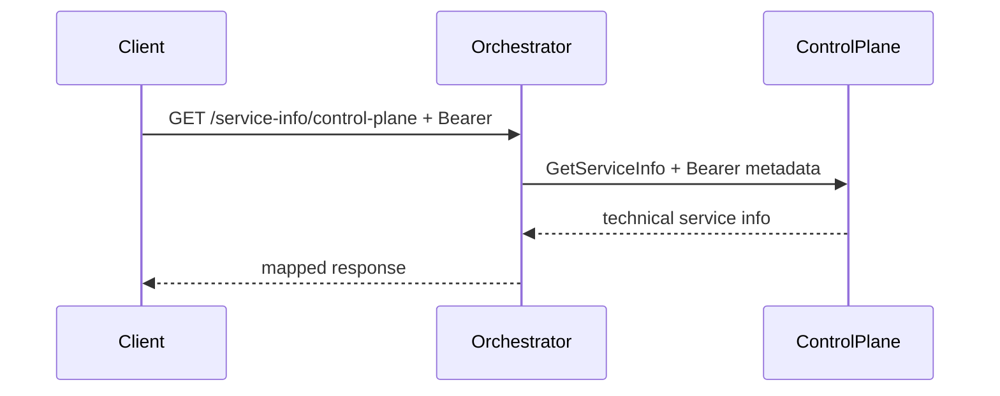

# AiControlCenter.Orchestrator.Api

ASP.NET Core host надає захищений технічний HTTP API, налаштовує MassTransit/RabbitMQ та викликає ControlPlane через gRPC.

## Поточні endpoints і transport

- `/service-info` потребує `AnyPlatformUser` і `PasswordChanged`.
- `/service-info/control-plane` передає вхідний Bearer token у gRPC metadata.
- MassTransit підключається до RabbitMQ і має transport retry, але consumers та бізнес-повідомлення не зареєстровані.
- Readiness перевіряє PostgreSQL і RabbitMQ; liveness не залежить від них.

Посилається на власні Application/Infrastructure та спільні Contracts, Grpc.Contracts, Observability, Security. Використовує gRPC client factory, MassTransit RabbitMQ, EF health, FluentValidation і OpenAPI.

[Orchestrator](../README.md) · [ControlPlane API](../../ControlPlane/AiControlCenter.ControlPlane.Api/README.md) · [Комунікація](../../../../docs/architecture/communication.md)
