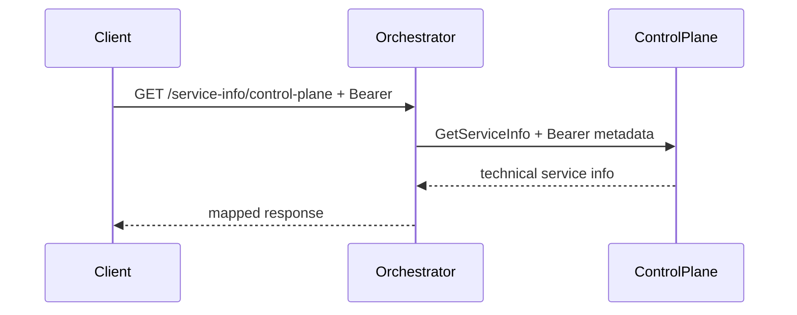

# AiControlCenter.Orchestrator.Api

ASP.NET Core host надає захищені Run REST endpoints, transactional MassTransit outbox, fault consumer та Worker progress gRPC. Для створення Run він отримує Agent snapshot із ControlPlane через delegated JWT.

## Endpoints і transport

- `/service-info` потребує `AnyPlatformUser` і `PasswordChanged`.
- `/service-info/control-plane` передає вхідний Bearer token у gRPC metadata.
- `POST /v1/runs`, `GET /v1/runs`, `GET /v1/runs/{id}` вимагають platform user і `PasswordChanged`; лише Admin бачить чужі Runs.
- `RunProgress` приймає authenticated Worker progress на HTTP/2 endpoint.
- EF bus outbox атомарно зберігає Run, execution command і status event; fault consumer завершує Run після вичерпання retries.
- Readiness перевіряє PostgreSQL і RabbitMQ; liveness не залежить від них.

Посилається на власні Application/Infrastructure та спільні Contracts, Grpc.Contracts, Observability, Security. Використовує gRPC client factory, MassTransit RabbitMQ, EF health, FluentValidation і OpenAPI.

[Orchestrator](../README.md) · [ControlPlane API](../../ControlPlane/AiControlCenter.ControlPlane.Api/README.md) · [Комунікація](../../../../docs/architecture/communication.md)
