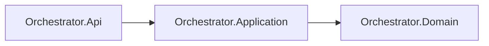

# AiControlCenter.Orchestrator.Application

Application layer координує створення, читання та state transitions `AgentRun`. Ports ізолюють PostgreSQL repository/unit of work, ControlPlane AgentCatalog і MassTransit transport; FluentValidation захищає command/query boundaries.

Create use case отримує immutable runnable snapshot, створює `Queued` Run і передає command/status у transactional outbox. Progress use cases виконуються в транзакції з production row lock та публікують status лише після застосованого переходу.

`ProjectReference`: `Orchestrator.Domain`. FluentValidation перевіряє bounded input, IDs, enum values і pagination.

[Orchestrator](../README.md) · [Domain](../AiControlCenter.Orchestrator.Domain/README.md) · [Правила залежностей](../../../../docs/architecture/dependency-rules.md)
