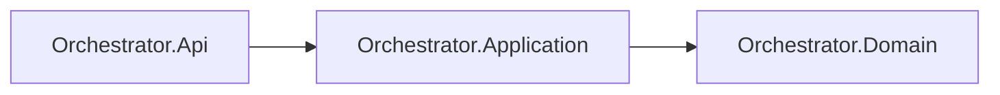

# AiControlCenter.Orchestrator.Application

Зарезервований application layer Orchestrator. Проєкт посилається на Domain, але use cases, ports, validators і handlers ще відсутні.

Технічний gRPC `ServiceInfo` та RabbitMQ connection належать composition/transport коду API і не утворюють application use case. Нові use cases мають працювати через власні доменні типи й interfaces.

`ProjectReference`: `Orchestrator.Domain`. NuGet-залежності відсутні.

[Orchestrator](../README.md) · [Domain](../AiControlCenter.Orchestrator.Domain/README.md) · [Правила залежностей](../../../../docs/architecture/dependency-rules.md)
