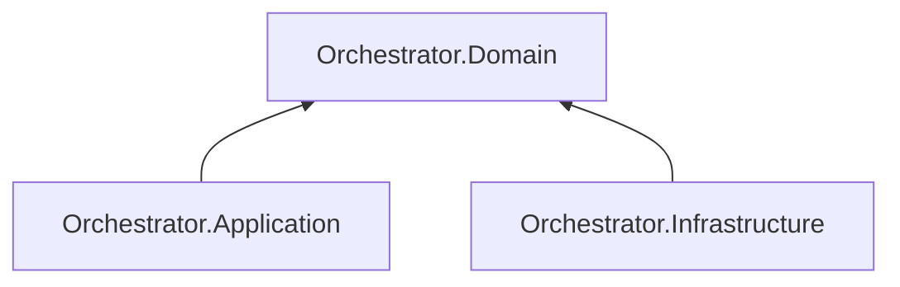

# AiControlCenter.Orchestrator.Domain

Чистий доменний шар містить `AgentRun`, `RunStep`, immutable `AgentSnapshot` і правила `Queued → Running → Succeeded/Failed` та `Queued → Failed`.

Aggregate перевіряє message ownership, idempotent repeats, порядок кроків, terminal states, bounded text і монотонні UTC timestamps. Проєкт не залежить від transport, persistence, ASP.NET Core, EF Core чи MassTransit.

`ProjectReference` і NuGet-залежності відсутні.

[Orchestrator](../README.md) · [Application](../AiControlCenter.Orchestrator.Application/README.md) · [Правила залежностей](../../../../docs/architecture/dependency-rules.md)
