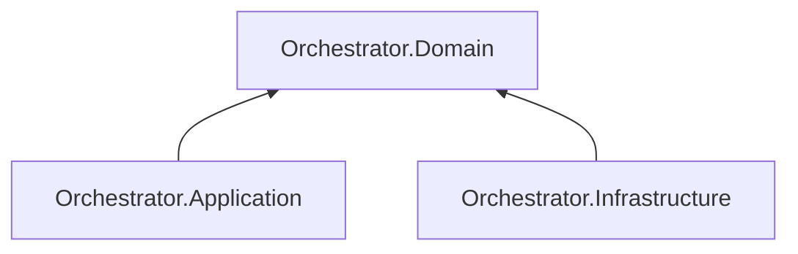

# AiControlCenter.Orchestrator.Domain

Чистий доменний шар Orchestrator. У поточній реалізації він не містить entities, value objects або business rules.

Проєкт не повинен залежати від transport, persistence, ASP.NET Core, EF Core чи MassTransit. RabbitMQ contracts також не належать домену.

`ProjectReference` і NuGet-залежності відсутні.

[Orchestrator](../README.md) · [Application](../AiControlCenter.Orchestrator.Application/README.md) · [Правила залежностей](../../../../docs/architecture/dependency-rules.md)
