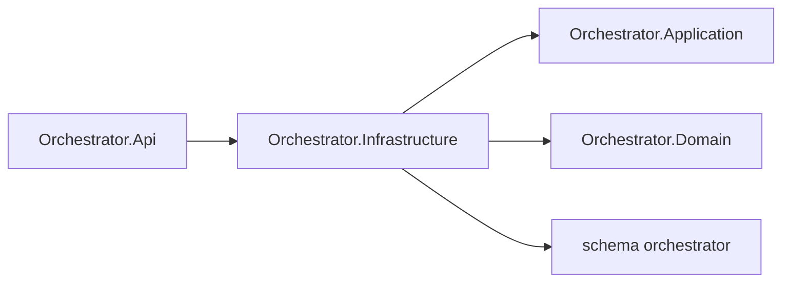

# AiControlCenter.Orchestrator.Infrastructure

Infrastructure реєструє `OrchestratorDbContext`, AgentRun repository/unit of work та migration `agent_runs`, `run_steps` і MassTransit outbox/inbox tables у власній PostgreSQL-схемі.

`AddOrchestratorInfrastructure` налаштовує Npgsql та власну migration history table. Production `FOR UPDATE` серіалізує конкуруючі progress calls, `xmin` виявляє optimistic conflicts. RabbitMQ і gRPC composition залишаються в API.

Посилається на Application і Domain; використовує EF Core, Npgsql provider та configuration abstractions.

[Orchestrator](../README.md) · [Api](../AiControlCenter.Orchestrator.Api/README.md) · [Integration tests](../../../../tests/Integration/AiControlCenter.Services.IntegrationTests/README.md)
