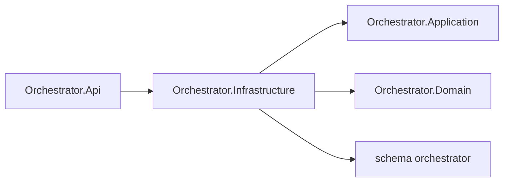

# AiControlCenter.Orchestrator.Infrastructure

Infrastructure реєструє `OrchestratorDbContext` і ізольовану PostgreSQL-схему. Entities, repositories та migrations зараз відсутні.

`AddOrchestratorInfrastructure` налаштовує Npgsql та власну migration history table. RabbitMQ і gRPC налаштовані в API, а не в цьому проєкті.

Посилається на Application і Domain; використовує EF Core, Npgsql provider та configuration abstractions.

[Orchestrator](../README.md) · [Api](../AiControlCenter.Orchestrator.Api/README.md) · [Integration tests](../../../../tests/Integration/AiControlCenter.Services.IntegrationTests/README.md)
