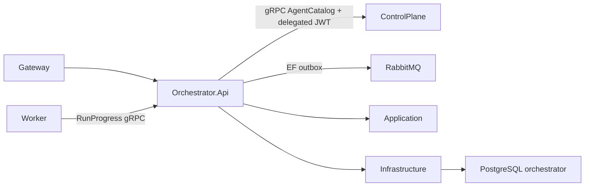

# Orchestrator

Orchestrator володіє `AgentRun`/`RunStep`, переходами стану та PostgreSQL transactional outbox. Він перевіряє runnable Agent snapshot через ControlPlane gRPC, асинхронно ставить Test execution у RabbitMQ і приймає progress Worker через окремо authenticated gRPC.

- [Api](AiControlCenter.Orchestrator.Api/README.md)
- [Application](AiControlCenter.Orchestrator.Application/README.md)
- [Domain](AiControlCenter.Orchestrator.Domain/README.md)
- [Infrastructure](AiControlCenter.Orchestrator.Infrastructure/README.md)

[Комунікація](../../../docs/architecture/communication.md) · [Межі сервісів](../../../docs/architecture/service-boundaries.md)

[Agents, Runs і Worker](../../../docs/architecture/agents-runs-worker.md)
