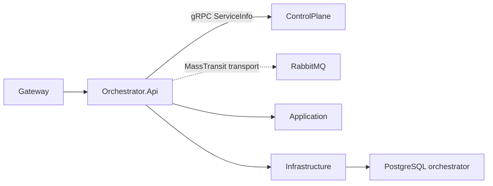

# Orchestrator

Orchestrator має ізольований API, PostgreSQL-схему, MassTransit transport і прямий технічний gRPC-клієнт ControlPlane. Бізнес-оркестрація, commands, events і consumers ще відсутні.

- [Api](AiControlCenter.Orchestrator.Api/README.md)
- [Application](AiControlCenter.Orchestrator.Application/README.md)
- [Domain](AiControlCenter.Orchestrator.Domain/README.md)
- [Infrastructure](AiControlCenter.Orchestrator.Infrastructure/README.md)

[Комунікація](../../../docs/architecture/communication.md) · [Межі сервісів](../../../docs/architecture/service-boundaries.md)
