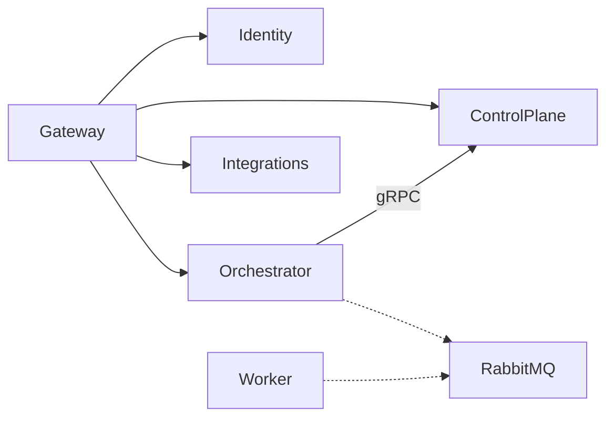

# Сервіси

Кожен сервіс володіє своїм кодом і даними. Прямі посилання на Domain/Application/Infrastructure іншого сервісу заборонені.

- [Identity](Identity/README.md)
- [ControlPlane](ControlPlane/README.md)
- [Orchestrator](Orchestrator/README.md)
- [Integrations](Integrations/README.md)
- [Worker](Worker/AiControlCenter.Worker.Service/README.md)

[Межі сервісів](../../docs/architecture/service-boundaries.md) · [Головний README](../../README.md)
