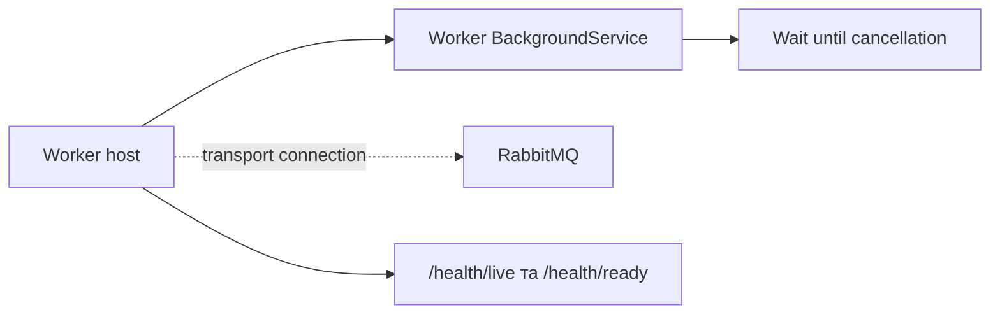

# AiControlCenter.Worker.Service

Фоновий ASP.NET Core host із health endpoints, технічним `/service-info` і налаштованим MassTransit RabbitMQ transport. `Worker` зараз лише очікує завершення процесу; business consumers і job execution відсутні.

## Поточний процес



Worker не має database context і не використовує JWT security, бо не приймає business HTTP requests. `/service-info` і health endpoints анонімні. Readiness перевіряє RabbitMQ.

Архітектурно проєкт може посилатися лише на `Contracts`, `Grpc.Contracts`, `Observability`; NuGet transport — `MassTransit.RabbitMQ`.

```powershell
dotnet run --project .\src\Services\Worker\AiControlCenter.Worker.Service\AiControlCenter.Worker.Service.csproj
```

[Сервіси](../../README.md) · [Contracts](../../../BuildingBlocks/AiControlCenter.Contracts/README.md) · [Комунікація](../../../../docs/architecture/communication.md)
