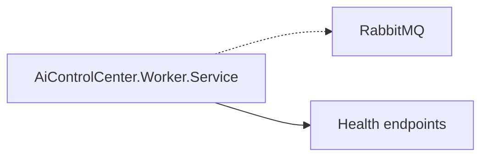

# Worker

Каталог містить фоновий executable Worker.

```mermaid
flowchart LR
    Worker["AiControlCenter.Worker.Service"] -.-> RabbitMQ
    Worker --> Health["Health endpoints"]
```

- [AiControlCenter.Worker.Service](AiControlCenter.Worker.Service/README.md)
- [Комунікація](../../../docs/architecture/communication.md)
