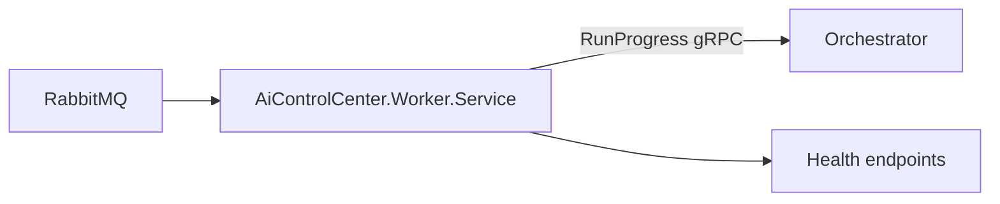

# Worker

Каталог містить stateless executable Worker для безпечного детермінованого Test workflow.

- [AiControlCenter.Worker.Service](AiControlCenter.Worker.Service/README.md)
- [Комунікація](../../../docs/architecture/communication.md)
