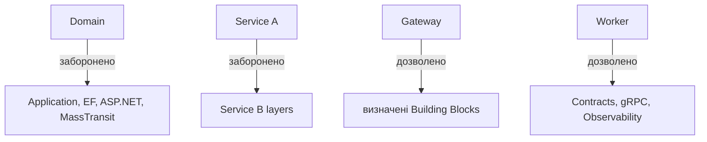

# AiControlCenter.ArchitectureTests

Тести читають `.csproj` і захищають напрямки залежностей незалежно від runtime.



`DependencyRulesTests` перевіряє layer references, відсутність cross-service references, allowlist Gateway/Worker і технічний склад Security. Перевірка шляхів нормалізує separator для Windows/Linux.

Проєкт використовує xUnit і `Microsoft.NET.Test.Sdk`; runtime-проєкти не підключає через `ProjectReference`.

```powershell
dotnet test .\tests\Architecture\AiControlCenter.ArchitectureTests\AiControlCenter.ArchitectureTests.csproj --configuration Release
```

[Правила залежностей](../../../docs/architecture/dependency-rules.md) · [Тести](../../README.md)
