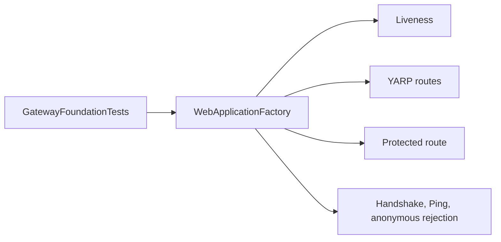

# AiControlCenter.Gateway.IntegrationTests

In-memory ASP.NET integration tests перевіряють публічний Gateway host без підняття всього Docker Compose.



`TestJwtTokenFactory` створює лише тестові RSA tokens для перевірки validation/policies. Наявні п’ять tests охоплюють liveness, proxy configuration, authenticated SignalR Ping, anonymous proxy rejection і anonymous SignalR rejection.

Посилається на Gateway і використовує `Microsoft.AspNetCore.Mvc.Testing`, SignalR client, xUnit і test SDK.

```powershell
dotnet test .\tests\Integration\AiControlCenter.Gateway.IntegrationTests\AiControlCenter.Gateway.IntegrationTests.csproj --configuration Release
```

[Gateway](../../../src/Gateway/AiControlCenter.Gateway/README.md) · [Тести](../../README.md)
