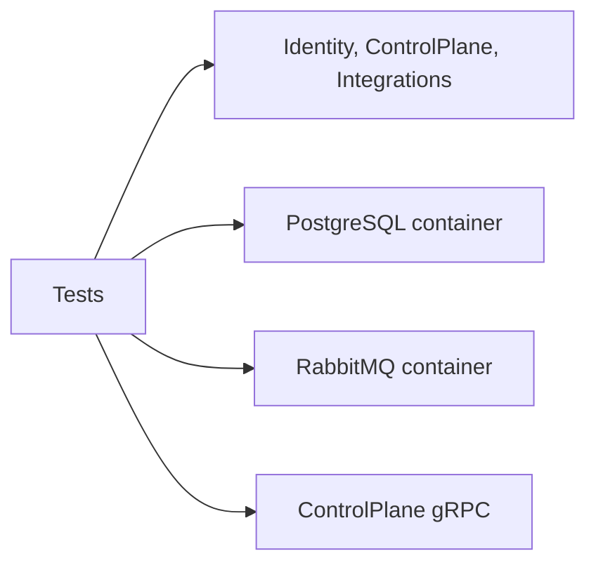

# AiControlCenter.Services.IntegrationTests

Integration suite перевіряє service hosts, Identity session flow і реальну сумісність PostgreSQL/RabbitMQ через Testcontainers.



## Покриття

- Identity: login → refresh rotation → password/admin operations → logout, а також rollback/reapply migrations.
- PostgreSQL: окремі owner roles і заборона доступу до чужої schema.
- RabbitMQ: test-only MassTransit publish/consume probe; він не є production contract.
- ControlPlane gRPC: versioned service info та anonymous rejection.
- Service hosts: liveness і захист direct Integrations service-info.

Посилається на потрібні API/Infrastructure проєкти й використовує Testcontainers PostgreSQL/RabbitMQ, WebApplicationFactory, gRPC client, MassTransit і xUnit. Для повного запуску потрібен доступний Docker Engine.

```powershell
dotnet test .\tests\Integration\AiControlCenter.Services.IntegrationTests\AiControlCenter.Services.IntegrationTests.csproj --configuration Release
```

[Identity](../../../src/Services/Identity/README.md) · [ControlPlane](../../../src/Services/ControlPlane/README.md) · [Тести](../../README.md)
