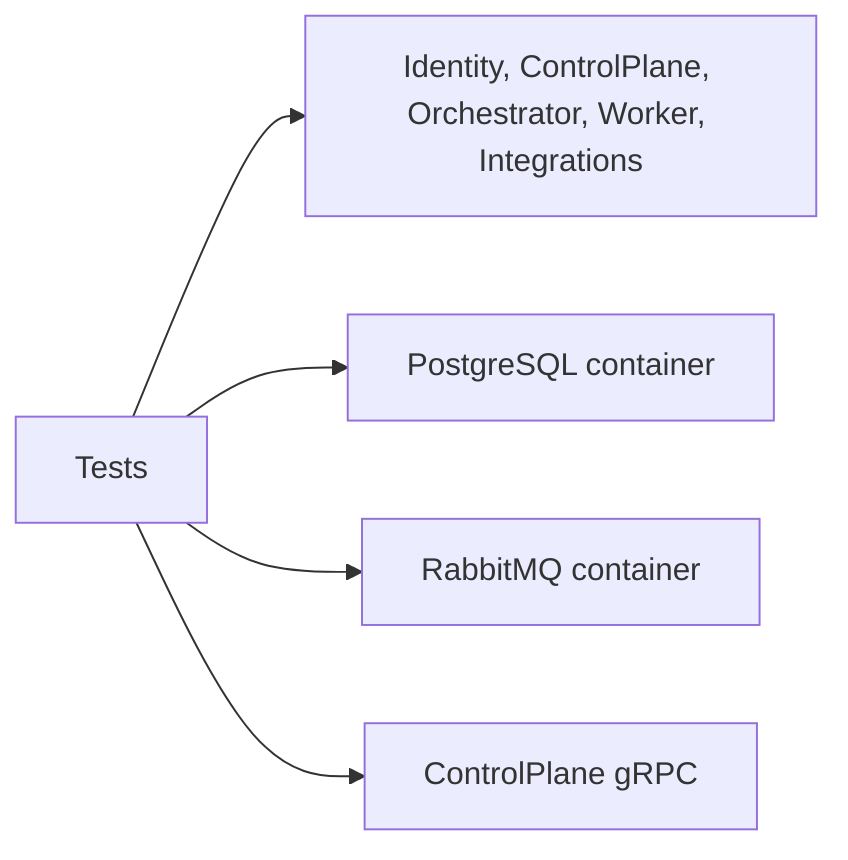

# AiControlCenter.Services.IntegrationTests

Integration suite перевіряє service hosts, Identity session flow, Agents/Runs/Worker і реальну сумісність PostgreSQL/RabbitMQ через Testcontainers.



## Покриття

- Identity: login → refresh rotation → password/admin operations → logout, а також rollback/reapply migrations.
- PostgreSQL: окремі owner roles і заборона доступу до чужої schema.
- RabbitMQ: production Orchestrator outbox і bounded command перевіряються з RabbitMQ Testcontainer; focused Worker consumer tests використовують in-memory MassTransit harness і mocked gRPC transport, а окремий production-transport test покриває RabbitMQ та реальний gRPC host.
- ControlPlane gRPC: versioned service info та anonymous rejection.
- ControlPlane Directions: migration `latest → 0 → latest`, constraints/indexes, persistence, create/read/update та archive/restore lifecycle, фільтри, optimistic concurrency і role matrix через фактичний API host та PostgreSQL Testcontainer.
- ControlPlane Agents: REST CRUD/status/archive/restore, Unicode validation, FK/constraints, concurrency, role matrix і versioned runnable snapshot gRPC.
- Orchestrator Runs: migration `latest → 0 → latest`, transactional outbox, ownership, REST, production progress gRPC, row-lock concurrency та persisted steps/logs.
- Worker: production consumer виконує детерміновані success/failure сценарії й надсилає точну послідовність bounded gRPC progress.
- Service hosts: liveness і захист direct Integrations service-info.

Посилається на потрібні API/Infrastructure проєкти й використовує Testcontainers PostgreSQL/RabbitMQ, WebApplicationFactory, gRPC client, MassTransit і xUnit. Для повного запуску потрібен доступний Docker Engine.

```powershell
dotnet test .\tests\Integration\AiControlCenter.Services.IntegrationTests\AiControlCenter.Services.IntegrationTests.csproj --configuration Release
```

[Identity](../../../src/Services/Identity/README.md) · [ControlPlane](../../../src/Services/ControlPlane/README.md) · [Orchestrator](../../../src/Services/Orchestrator/README.md) · [Тести](../../README.md)
