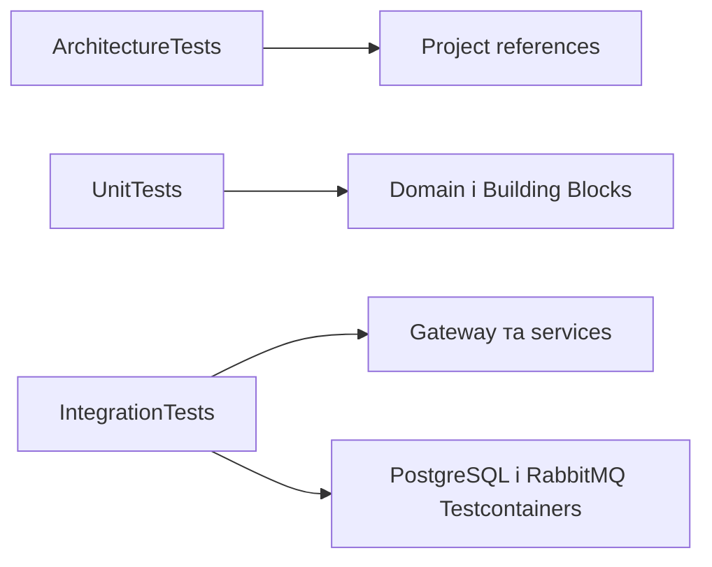

# Тести

Solution розділяє structural rules, isolated unit tests і integration tests реальних host/infra boundaries.



- [Architecture tests](Architecture/AiControlCenter.ArchitectureTests/README.md)
- [Building Blocks unit tests](Unit/AiControlCenter.BuildingBlocks.UnitTests/README.md)
- [Identity unit tests](Unit/AiControlCenter.Identity.UnitTests/README.md)
- [ControlPlane unit tests](Unit/AiControlCenter.ControlPlane.UnitTests/README.md)
- [Gateway integration tests](Integration/AiControlCenter.Gateway.IntegrationTests/README.md)
- [Services integration tests](Integration/AiControlCenter.Services.IntegrationTests/README.md)

```powershell
dotnet test .\AiControlCenter.sln --configuration Release
```

[Головний README](../README.md)
