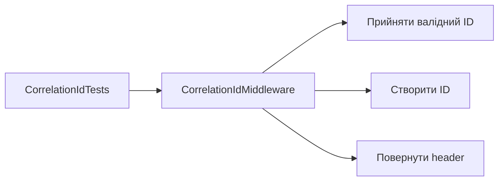

# AiControlCenter.BuildingBlocks.UnitTests

Unit tests перевіряють детерміновану поведінку спільних технічних компонентів без запуску зовнішньої інфраструктури.



Наявні theory/facts перевіряють прийняття коректного correlation ID, генерацію для відсутнього/некоректного значення та заголовок відповіді.

Посилається на `Contracts`, `Grpc.Contracts`, `Observability`; використовує xUnit і test SDK.

```powershell
dotnet test .\tests\Unit\AiControlCenter.BuildingBlocks.UnitTests\AiControlCenter.BuildingBlocks.UnitTests.csproj --configuration Release
```

[Observability](../../../src/BuildingBlocks/AiControlCenter.Observability/README.md) · [Тести](../../README.md)
