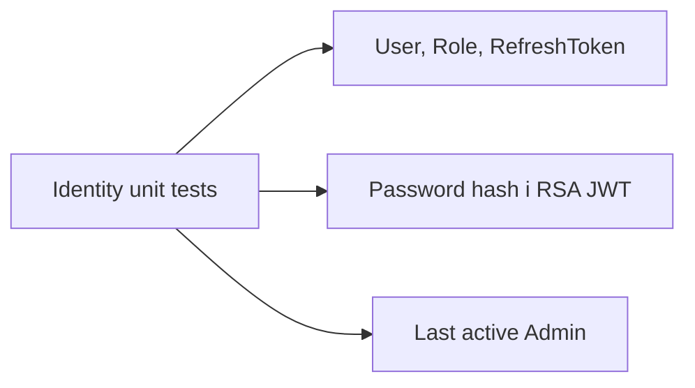

# AiControlCenter.Identity.UnitTests

Unit tests фіксують Identity domain invariants і security primitives без HTTP host або database container.



- `IdentityDomainTests` перевіряє value objects і переходи стану refresh/user.
- `IdentitySecurityTests` перевіряє IdentityV3 PBKDF2 та межі RS256 access token/claims.
- `LastAdminTests` перевіряє заборону блокування останнього активного Admin.

Посилається на Identity Domain/Application/Infrastructure; використовує xUnit і test SDK.

```powershell
dotnet test .\tests\Unit\AiControlCenter.Identity.UnitTests\AiControlCenter.Identity.UnitTests.csproj --configuration Release
```

[Identity Domain](../../../src/Services/Identity/AiControlCenter.Identity.Domain/README.md) · [Тести](../../README.md)
